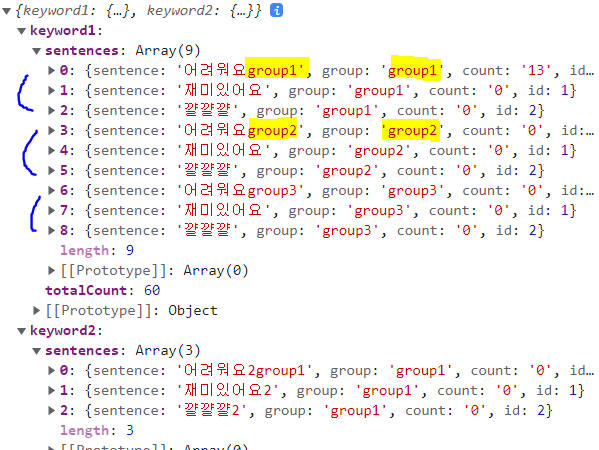

# 📃 API

| Description          | Function                                | parameter                                                    | return                                                       | 비고           |
| -------------------- | --------------------------------------- | ------------------------------------------------------------ | ------------------------------------------------------------ | -------------- |
| 전체 데이터 가져오기 | getTotalData()                          |                                                              | {키워드: { "sentences": [ idx: { "sentence": string, "group": string, "count": string, "id": integer }] "totalCount": string } } |                |
| 데이터 저장          | setData()                               |                                                              |                                                              |                |
| 그룹 데이터 저장하기 | addGroups (group)                       | group: 그룹이름(string)                                      |                                                              |                |
| 그룹 데이터 가져오기 | getGroups()                             |                                                              | [ idx: 그룹이름 ]                                  | 백에서만 사용  |
| 카운트 수정          | updateCount(group, keyword, sentenceId) | group: 그룹이름(string), keyword: 키워드(string), sentenceId: 문장 id(integer) |                                                              | count 1씩 증가 |
| 키워드 삭제          | deleteKeyword(group, keyword)           | group: 그룹이름(string) keyword: 키워드(string)         |                                                              |                |
| 비밀번호 저장        | setPassword(password)                   | password: 비밀번호(string)                                   |                                                              |                |
| 비밀번호 수정        | updatePassword(newPassword)             | newPassword: 비밀번호(string)                                |                                                              |                |
| 계급데이터 가져오기  | getDataByGroups()                       |                                                              |                                                              |                |
|                      |                                         |                                                              |                                                              |                |
|                      |                                         |                                                              |                                                              |                |
|                      |                                         |                                                              |                                                              |                |
|                      |                                         |                                                              |                                                              |                |
|                      |                                         |                                                              |                                                              |                |

## getTotalData()

